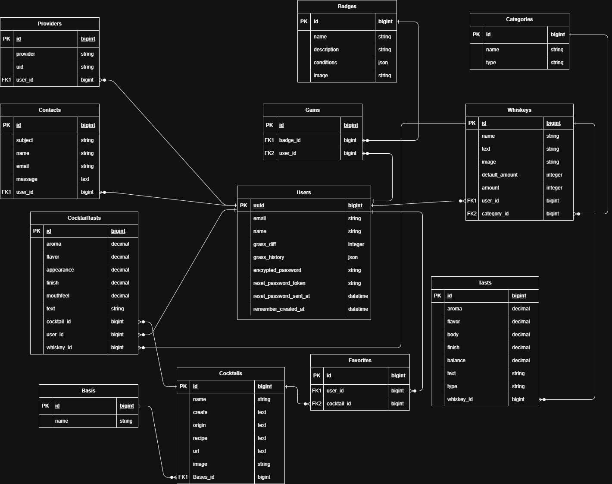

# 【Uisce-Beatha】（ウシュクベーハ）

# 目次
- [【Uisce-Beatha】（ウシュクベーハ）](#uisce-beathaウシュクベーハ)
- [目次](#目次)
- [サービス概要](#サービス概要)
- [サービスURL](#サービスurl)
- [このサービスへの思い・作りたい理由](#このサービスへの思い作りたい理由)
- [機能紹介](#機能紹介)
- [技術構成](#技術構成)
  - [使用技術](#使用技術)
  - [画面遷移図\&画面仕様書](#画面遷移図画面仕様書)
  - [ER図](#er図)

# サービス概要
  ・USQUAアプリの改良版
  ・ウイスキーを登録し、管理、探求するアプリ
  ・探求の部分では、ウイスキーベースのカクテル一覧で、レシピ、動画での作成の仕方、由来などを表示
  ・（プラスα）1ヶ月の飲酒を記録できる。
  ・（プラスα）aiを使用しておすすめの飲み方を提供できる。
   

# サービスURL

# このサービスへの思い・作りたい理由
  ・卒業制作で作成したアプリである「USQUA」アプリを改良して、もっと使いやすいアプリにしたい。
  ・一から作りなおして、違った環境で構築したい。
  という上記の思いから改良しようと思いました。
   

# 機能紹介
# 技術構成

## 使用技術
| カテゴリ | 技術 |
| --- | --- |
| サーバーサイド | Ruby on Rails / Ruby |
| フロントエンド | next.js / react |
| CSSフレームワーク | TailwindCSS |
| データベース | MYSQL |
| アプリケーションサーバー | Heroku |
| コンテナ管理 | docker |
| バージョン管理ツール | GitHub |
 

## 画面遷移図&画面仕様書

 

## ER図

